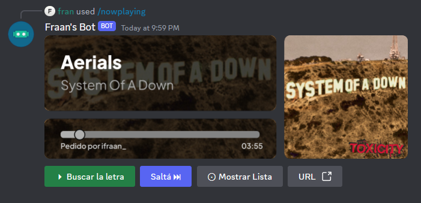

<div align="center">
	<h1>Fraan's Music Bot</h1>
	<a href="https://www.codefactor.io/repository/github/ifraan/fraans-discord-music"></a>
	<a href="https://github.com/iFraan/fraans-discord-music"></a>
	<a href="https://github.com/iFraan/fraans-discord-music/issues"></a>
	<h2>A music discord bot written using discord-player and love</h2>
</div>

## Dependencies

OS:

-   Node > 16.x
-   FFMPEG

Package:

-   discord.js@14
-   discord-player@6
-   play-dl

## Installation

> You need to create a Discord Application to get an usable TOKEN

> Note that Node v16+ is required

To install clone the repository and install the dependencies

```shell
git clone https://github.com/iFraan/fraans-discord-music.git
npm install
npm run start
```

## Screenshots





## Features

| Feature                                      | Status                  |
| -------------------------------------------- | ----------------------- |
| Discord Interactions (slash & buttons)       | ✅                       |
| Add to Queue                                 | ✅ (see [Sites](#sites)) |
| Controls (pause/skip/resume)                 | ✅                       |
| Playlist Support                             | ✅                       |
| Audio Filters                                | ✅                       |
| Skip (select menu with queue && number)      | ✅                       |
| DJ Roles                                     | 🗓️                       |
| Lyrics                                       | ✅                       |
| Shuffle                                      | ✅                       |
| AutoPlay (similar tracks after end of queue) | ✅                       |
| Multi-Language Support                       | ✅                       |
| More...                                      | ⬜                       |

## Language Support

| Language            | Status |
| ------------------- | ------ |
| Spanish (Argentina) | ✅      |
| Spanish (Spain)     | ✅      |
| English (US)        | ✅      |
| German              | ✅      |
| Português (Brasil)  | ✅      |
| More...             | ⬜      |

## Sites

Extractors are provided by _discord-player_ and the list can be extended using the [ExtractorAPI](https://discord-player.js.org/docs/guides/creating-extractor)

As of today, current extractors are:

| Site         | Link | Playlist |
| ------------ | ---- | -------- |
| Youtube      | ✅    | ✅        |
| Spotify      | ✅    | ✅        |
| AppleMusic   | ✅    | 🗓️        |
| Vimeo        | ✅    | ⬜        |
| Reverbnation | ✅    | ⬜        |
| Soundcloud   | ✅    | 🗓️        |

## Disclaimer

This project is provided completely free "as is" as it was made solely for educational purposes. You are free to copy and modify this software as you see fit.
